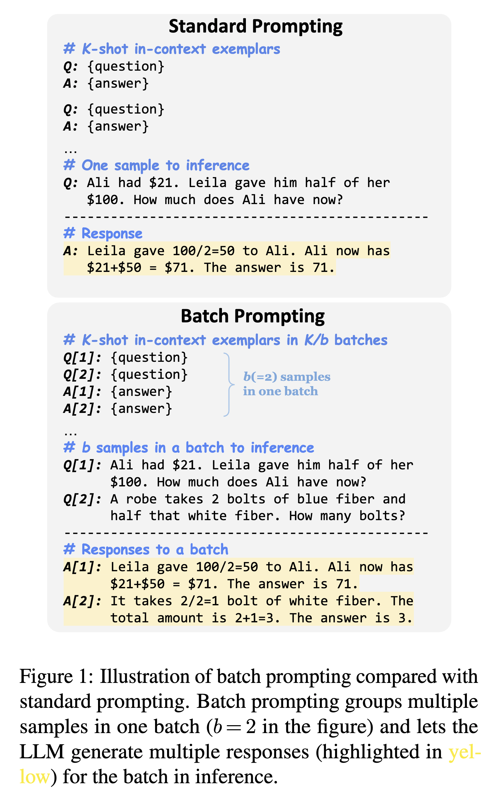

# Batch Prompting: Efficient Inference with Large Language Model APIs

## Authors and Affiliations
- **Zhoujun Cheng** (Shanghai Jiao Tong University)
- **Jungo Kasai** (University of Washington)
- **Tao Yu** (University of Hong Kong)

#### Abstract
Performing inference with large language models (LLMs) on large datasets can be both computationally and financially expensive. The authors propose a method called "batch prompting" to improve efficiency. This approach allows LLMs to process multiple samples simultaneously instead of one at a time, significantly reducing both token and time costs while maintaining or improving performance.

#### Introduction
LLMs have shown strong performance in few-shot learning settings. However, performing inference on a large scale using standard prompting methods is costly. Batch prompting offers a solution by grouping multiple samples into one batch, thus reducing the number of inference runs required.

#### Approach
Batch prompting allows an LLM to generate responses for multiple samples in one API call. This method involves organizing K in-context exemplars into batches, where the LLM learns from these examples and produces responses for multiple test samples in one go. This reduces token and time costs almost inverse linearly with the number of samples in each batch.

#### Theoretical Demonstration
The authors demonstrate that in a few-shot learning setting, most tokens during an API call are consumed by the in-context exemplars rather than the inference samples. Therefore, increasing the number of samples in each batch reduces the token costs significantly.

#### Experiments
Batch prompting was tested on ten datasets across different tasks, including commonsense question answering (QA), arithmetic reasoning, and natural language understanding (NLU). The results showed that batch prompting significantly reduces both token and time costs while achieving comparable or better performance than standard prompting. The method was effective on different LLMs, including GPT-3.5 and GPT-4.

| Task         | Dataset     | Standard | Batch          |
|--------------|-------------|----------|----------------|
| Commonsense  | CSQA        | 77.2     | **77.4** (+0.2) |
|              | StrategyQA  | **73.3** | 71.0 (−2.3)     |
| Arithmetic   | GSM8K       | 55.7     | **58.7** (+3.0) |
|              | SVAMP       | **83.7** | 81.3 (−2.4)     |
|              | AQuA        | **46.1** | 42.1 (−4.0)     |
|              | AddSub      | **86.6** | 84.8 (−1.8)     |
|              | MultiArith  | 97.5     | **98.7** (+1.2) |
| NLI/NLU      | RTE         | **76.9** | 74.7 (−2.2)     |
|              | MNLI        | 65.3     | **65.7** (+0.4) |
|              | SST-5       | **51.3** | 49.7 (−1.6)     |

#### Analysis
Further analysis revealed that the number of samples in each batch and the complexity of the tasks affect the performance of batch prompting. Additionally, the method works well across different reasoning methods, such as end-to-end, Chain-of-Thought, and code generation.

#### Limitations
The authors note that batch prompting may not be suitable for tasks that require generating a large amount of output tokens, such as story generation. Additionally, task complexity and long input contexts can negatively impact performance. They suggest testing batch prompting on a smaller subset of data to gauge its effectiveness before large-scale implementation.

#### Conclusion
Batch prompting is presented as a simple yet effective method for reducing the costs of LLM inference while maintaining good performance. This method offers practical value for real-world applications that require efficient LLM usage.

#### Code
The code for batch prompting is available at: [https://github.com/xlang-ai/batch-prompting](https://github.com/xlang-ai/batch-prompting).