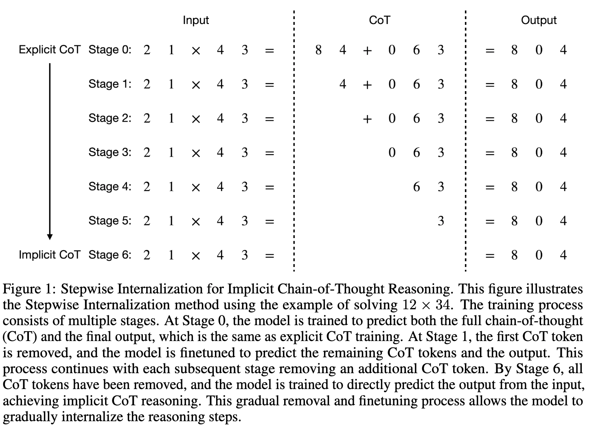

# From Explicit CoT to Implicit CoT: Learning to Internalize CoT Step by Step
[link](https://arxiv.org/abs/2405.14838)

## Authors and Affiliations
- **Yuntian Deng** (Allen Institute for Artificial Intelligence, University of Waterloo)
- **Yejin Choi** (Allen Institute for Artificial Intelligence, University of Washington)
- **Stuart Shieber** (Harvard University)

## Introduction
- **Goal**: Internalize chain-of-thought (CoT) reasoning within language models to improve efficiency.
- **Problem**: Explicit CoT reasoning enhances performance but is computationally intensive.

## Method: Stepwise Internalization
- **Process**: 
  - Start with a model trained for explicit CoT reasoning.
  - Gradually remove intermediate CoT steps during training.
  - Finetune the model to internalize reasoning steps.

## Experimental Setup
- **Tasks**: Multi-digit multiplication and GSM8K (grade-school math problems).
- **Models**: Tested on GPT-2 Small and Mistral 7B.

## Results
- **Multiplication Tasks**: 
  - GPT-2 Small achieves near-perfect accuracy on 9x9 multiplication.
  - Outperforms No CoT and Implicit CoT via Knowledge Distillation (ICoT-KD).
- **GSM8K**: 
  - Mistral 7B achieves over 50% accuracy, outperforming GPT-4's 44% without intermediate steps.

## Analysis
- **Trade-off**: Balances accuracy and inference speed by adjusting internalized CoT tokens.
- **Ablation Studies**: Confirms robustness of the method.

## Limitations
- **Training Costs**: High due to iterative finetuning.
- **Stability**: Aggressive removal schedules can cause instability.

## Conclusions and Future Work
- **Future Directions**: Apply the method to more tasks and larger models, and combine implicit and explicit CoT training for flexibility.

**Link to Paper**: [GitHub](https://github.com/da03/Internalize_CoT_Step_by_Step)