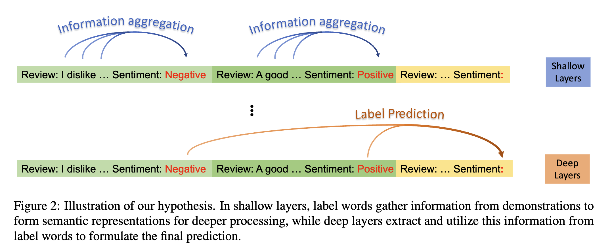
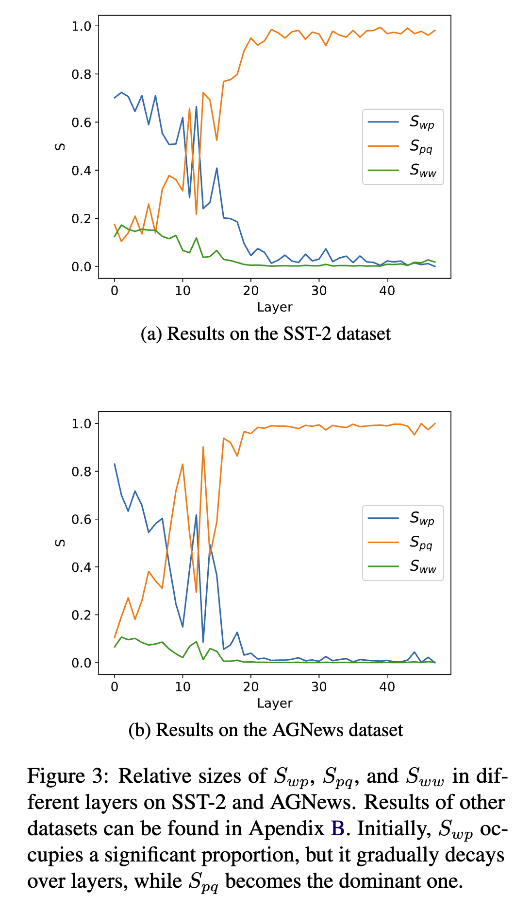

# Label Words are Anchors: An Information Flow Perspective for Understanding In-Context Learning

## Authors and Affiliations
- **Lean Wang** (National Key Laboratory for Multimedia Information Processing, School of Computer Science, Peking University)
- **Lei Li** (National Key Laboratory for Multimedia Information Processing, School of Computer Science, Peking University)
- **Damai Dai** (National Key Laboratory for Multimedia Information Processing, School of Computer Science, Peking University)
- **Deli Chen** (Pattern Recognition Center, WeChat AI, Tencent Inc., China)
- **Hao Zhou** (Pattern Recognition Center, WeChat AI, Tencent Inc., China)
- **Fandong Meng** (Pattern Recognition Center, WeChat AI, Tencent Inc., China)
- **Jie Zhou** (Pattern Recognition Center, WeChat AI, Tencent Inc., China)
- **Xu Sun** (National Key Laboratory for Multimedia Information Processing, School of Computer Science, Peking University)

## Abstract
In-context learning (ICL) allows large language models (LLMs) to perform various tasks by providing demonstration examples. However, the underlying mechanism remains unclear. This paper explores ICL's mechanism through an information flow perspective, revealing that label words in examples act as anchors. These anchors aggregate semantic information in shallow layers and guide final predictions in deep layers. Based on this, the paper introduces methods for enhancing ICL performance, expediting inference, and diagnosing errors.

## Introduction
- ICL has emerged as a powerful capability of LLMs, enabling them to perform tasks like text classification and mathematical reasoning using few-shot demonstration examples.
- Unlike traditional learning, ICL does not require updating model parameters and relies on natural language instructions, making it a promising approach.
- The paper aims to understand the mechanism of ICL through the lens of information flow and proposes practical applications to improve ICL.

## Key Insights
1. **Label Words as Anchors**: 
   - In shallow layers, label words gather information from the demonstration examples.
   - In deep layers, models extract this aggregated information to make final predictions.
2. **Hypothesis**: 
   - H1: In shallow layers, label words aggregate semantic information.
   - H2: In deep layers, the model uses label words to guide final predictions.

## Methods and Experiments
### Saliency Scores and Information Flow
- **Metrics**:
  - $S_{wp}$: Information flow from text to label words in shallow layers.
  - $S_{pq}$: Information flow from label words to target positions in deep layers.
  - $S_{ww}$: Information flow among all words.
- **Results**:
  - $S_{wp}$ is high in shallow layers, while $S_{pq}$ dominates in deep layers.
  - Blocking information flow to label words in shallow layers significantly impairs model performance.

### Anchor Re-weighting
- **Method**:
  - Introduces a learnable vector to adjust the significance of label words in attention matrix, improving ICL accuracy by 16.7%.
- **Results**:
  - Significant accuracy improvements across multiple datasets compared to standard ICL baselines.

### Context Compression
- **Method**:
  - Reduces input context to pre-calculated anchor representations, speeding up inference by 1.8× with minimal performance loss.
- **Results**:
  - Effective compression with substantial inference speedup.

### Error Analysis
- **Method**:
  - Uses anchor distances to diagnose ICL errors, revealing that similar anchor representations can cause prediction errors.
- **Results**:
  - High correlation between predicted and actual confusion matrices, providing insights into model errors.

## Conclusion
- The paper confirms that label words act as anchors in ICL, guiding information flow from shallow to deep layers.
- Proposed methods for re-weighting anchors, compressing context, and diagnosing errors demonstrate practical improvements and validate the anchor hypothesis.
- Future work should explore other ICL paradigms and larger models to further refine these findings.

## Repository
For more information and access to the code and datasets used in this research, visit the [GitHub repository](https://github.com/lancopku/label-words-are-anchors).