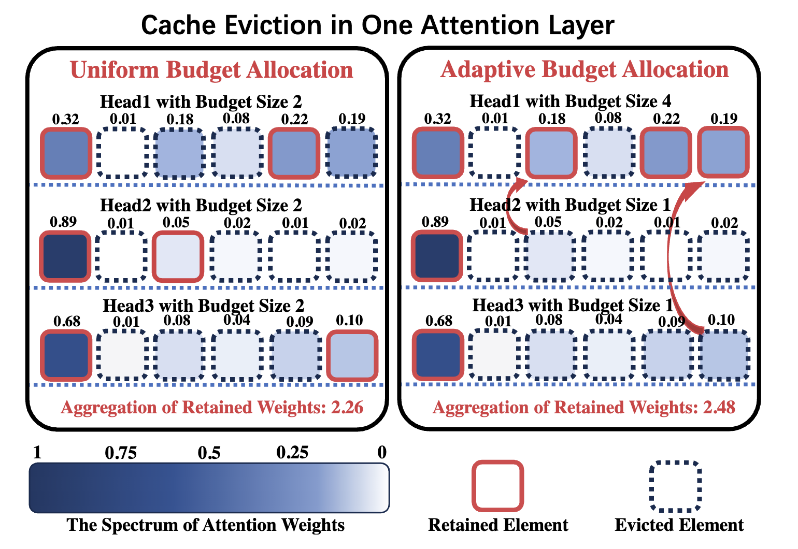

### Ada-KV: Optimizing KV Cache Eviction by Adaptive Budget Allocation for Efficient LLM Inference

## Authors and Affiliations
- **Yuan Feng**, **Junlin Lv**, **Yukun Cao**, **Xike Xie**, **S. Kevin Zhou**
- Affiliations:
  - University of Science and Technology of China (USTC)
  - Data Darkness Lab, MIRACLE Center, Suzhou Institute for Advanced Research, USTC

## Abstract
Ada-KV introduces an adaptive budget allocation algorithm to optimize Key-Value (KV) cache eviction during inference in large language models (LLMs). The method addresses the inefficiencies of uniform budget allocation across attention heads by dynamically reallocating resources based on head-specific characteristics. Extensive evaluations on 16 datasets demonstrate that Ada-KV significantly improves generation quality and memory efficiency, with seamless integration into state-of-the-art (SOTA) methods like SnapKV and Pyramid.

## Introduction
- **Problem**: LLMs face memory and efficiency challenges due to expanding KV cache size during long-sequence inference. Existing cache eviction methods uniformly allocate budgets across attention heads, leading to suboptimal resource utilization.
- **Solution**: Ada-KV proposes an adaptive budget allocation algorithm that dynamically reallocates resources based on the concentration degree of attention heads, optimizing KV cache eviction and improving post-eviction generation quality.

## Methodology
### Theoretical Foundation
- **L1 Eviction Loss**: Ada-KV minimizes the L1 distance between pre- and post-eviction outputs, optimizing cache eviction by reducing this theoretical loss upper bound.
- **Adaptive Budget Allocation**: Allocates budgets to attention heads based on their specific characteristics, improving efficiency compared to uniform allocation.

### Algorithm Integration
- **Integration with SOTA Methods**: Ada-KV is integrated into SnapKV and Pyramid, enhancing these methods' ability to handle long-sequence tasks with improved generation quality.

## Experiments
### Evaluation
- **Datasets**: 16 datasets from LongBench, including single-document QA, multi-document QA, summarization, and few-shot learning tasks.
- **Results**: Ada-KV outperforms baseline methods in generation quality and long-context retrieval capabilities, with consistent improvements across different budget sizes.

### Ablation Studies
- **Budget Allocation**: Demonstrates the advantages of adaptive over uniform budget allocation, achieving lower eviction loss and better resource utilization.

## Conclusion
Ada-KV significantly enhances the efficiency of KV cache eviction in LLMs by introducing an adaptive budget allocation algorithm. It achieves substantial improvements in memory efficiency and generation quality, making it a valuable addition to existing LLM inference techniques.

## Repository
For more information and access to the code, visit the [GitHub repository](https://github.com/FFY0/AdaKV).