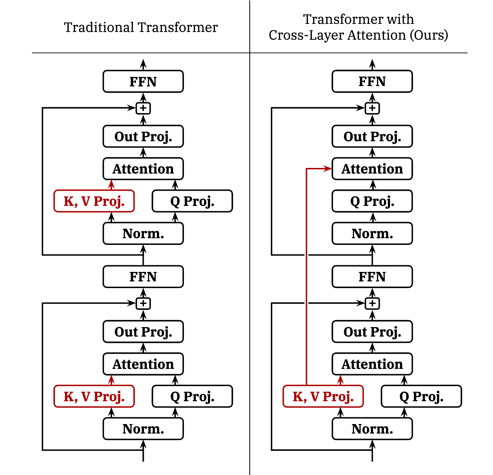
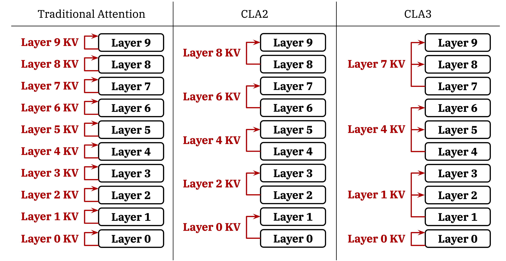

### Reducing Transformer Key-Value Cache Size with Cross-Layer Attention

## Authors and Affiliations
- **William Brandon** (MIT CSAIL)
- **Mayank Mishra** (MIT-IBM Watson AI Lab)
- **Aniruddha Nrusimha** (MIT CSAIL)
- **Rameswar Panda** (MIT-IBM Watson AI Lab)
- **Jonathan Ragan-Kelley** (MIT CSAIL)

## Abstract
This paper introduces Cross-Layer Attention (CLA), a method to reduce the key-value (KV) cache size in transformer-based LLMs by sharing KV activations across layers. CLA achieves a 2× reduction in KV cache size with minimal accuracy degradation. Experiments on 1B- and 3B-parameter models demonstrate that CLA offers Pareto improvements over Multi-Query Attention (MQA) and Grouped-Query Attention (GQA) in terms of memory and accuracy trade-offs.

## Introduction
- **Context**: Large KV cache sizes in LLMs limit batch sizes and require costly offloading techniques.
- **CLA Innovation**: Shares KV activations between adjacent layers, reducing the memory footprint while maintaining performance.

## Methodology
### Cross-Layer Attention (CLA)
- **Multi-Query Attention (MQA)**: Shares key/value heads across query heads within a layer, reducing KV cache size.
- **Grouped-Query Attention (GQA)**: Generalizes MQA by grouping query heads.
- **CLA**: Extends MQA/GQA by sharing key/value heads between adjacent layers, further reducing KV cache size.

### Implementation
- **KV Cache Sharing**: Only a subset of layers computes KV projections, which are reused by subsequent layers.
- **Configurations**: CLA2 (sharing between 2 layers), CLA3 (sharing between 3 layers), etc.

## Experiments
### 1B-Parameter Scale
- **Design Space Exploration**: Compared CLA configurations with MQA/GQA baselines.
- **Results**: CLA2 models achieve better perplexity with the same or lower KV cache memory footprint than MQA/GQA baselines.

### 3B-Parameter Scale
- **Learning Rate Tuning**: CLA2 models with tuned learning rates outperform MQA baselines in perplexity.
- **Results**: CLA2 models achieve significant memory savings and improved perplexity compared to MQA models.

### Downstream Evaluations
- **Tasks**: Evaluated on various benchmarks (Hellaswag, PIQA, WinoGrande, etc.).
- **Results**: CLA models perform comparably to MQA baselines across different tasks.

## Conclusion
CLA effectively reduces the KV cache size in transformer models by sharing KV activations across layers, achieving substantial memory savings with minimal impact on accuracy. The method advances the memory-efficiency frontier for LLMs, enabling longer sequences and larger batch sizes.

## Repository
For more information and access to the code, visit the [GitHub repository](https://github.com/whyNLP/LCKV).