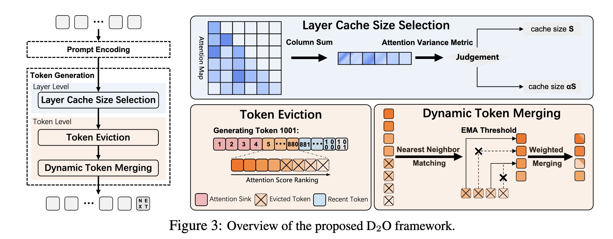

### D2O: Dynamic Discriminative Operations for Efficient Generative Inference of Large Language Models

## Authors and Affiliations
- **Zhongwei Wan** (The Ohio State University)
- **Xinjian Wu** (University of Chinese Academy of Sciences)
- **Yu Zhang** (Tongji University)
- **Yi Xin** (Nanjing University)
- **Chaofan Tao** (The University of Hong Kong)
- **Zhihong Zhu** (Peking University)
- **Xin Wang** (The Ohio State University)
- **Siqi Luo** (Nanjing University)
- **Jing Xiong** (The University of Hong Kong)
- **Mi Zhang** (The Ohio State University)

## Abstract
D2O introduces a novel KV cache eviction strategy for large language models (LLMs), optimizing memory usage while maintaining high-quality generation. It utilizes layer-level and token-level discriminative operations, reducing memory demand and improving throughput by over 3× without fine-tuning. D2O retains important tokens and dynamically adjusts the KV cache, preventing information loss and preserving context.

## Introduction
- **Context**: LLMs require significant KV cache memory, limiting their efficiency in handling long sequences.
- **Solution**: D2O addresses this by using dynamic discriminative operations to selectively evict less critical KV pairs, ensuring efficient memory usage and high-quality long-text generation.

## Methodology

### Layer-Level Discriminative Operation
- **Attention Density Metric**: Measures attention density across layers to determine cache size.
- **Dynamic Cache Allocation**: Allocates smaller cache sizes to layers with high variance in attention scores, reducing memory consumption.

### Token-Level Discriminative Operation
- **Token Eviction**: Uses cumulative attention scores to identify and evict less critical tokens, maintaining a stable cache size.
- **Dynamic Token Merging**: Reintegrates discarded tokens based on their similarity to retained tokens, using an exponential moving average (EMA) threshold to ensure contextual integrity.

### Algorithm Pseudo Code
```markdown
Algorithm 1: One forward pass in D2O
Input: KV cache KV, recent window length L, min PvC length N = {N0, ..., Nl, ...}
Output: updated KV cache KV

for layer l ∈ layers do
    if KV is not None then
        KV = cat([PvCpast, KV])
    A ← compute attention weights of KV
    Ae ← weighted_avg(A[−L :, : −L], dim = −2)
    if len(KV) > Nl then
        TopP_index ← TopP(Ae, p = p)
        PvC ← Gather(KV, index = TopP_index)
        KV ← PvC
    Reduce p by multiplying a decay ratio
return KV
```

## Experiments
### Performance Evaluation
- **Models**: Evaluated on Llama, Falcon, and Mistral models.
- **Tasks**: Tested on reasoning, long-context QA, summarization, and code completion tasks.
- **Results**: D2O significantly enhances performance, especially with reduced KV cache budgets, and outperforms existing methods like StreamingLLM and H2O.

### Memory Efficiency
- **Memory Reduction**: Up to 54.6% less GPU memory usage.
- **Throughput Improvement**: Up to 3× higher throughput compared to baseline methods.

### Long-Context Retrieval and Modeling
- **Needle-in-a-Haystack Test**: D2O outperforms other methods in retrieving specific sentences from extensive documents.
- **Long Sequence Modeling**: Demonstrates superior performance in handling long sequences with lower perplexity.

## Conclusion
D2O effectively reduces KV cache memory usage in LLMs, offering substantial memory savings and throughput improvements while maintaining high performance. It dynamically manages KV cache to preserve valuable context information, making it suitable for real-world long-context applications.

