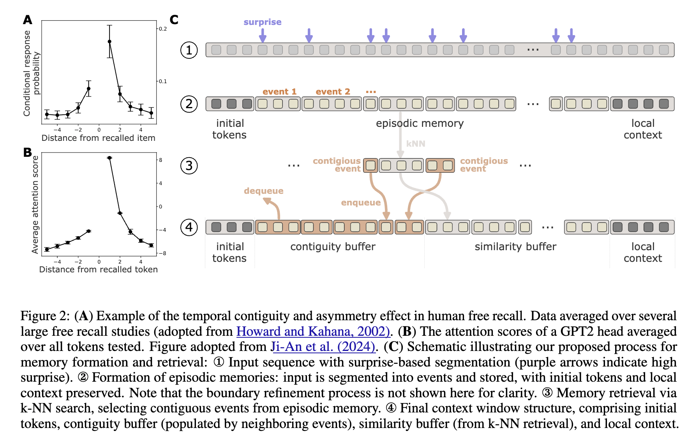

### HUMAN-LIKE EPISODIC MEMORY FOR INFINITE CONTEXT LLMS

## Authors and Affiliations
- **Zafeirios Fountas** (Huawei Noah’s Ark Lab, London, UK)
- **Martin A Benfeghoul** (Huawei Noah’s Ark Lab, London, UK)
- **Adnan Oomerjee** (Huawei Noah’s Ark Lab, London, UK)
- **Fenia Christopoulou** (Huawei Noah’s Ark Lab, London, UK)
- **Gerasimos Lampouras** (Huawei Noah’s Ark Lab, London, UK)
- **Haitham Bou-Ammar** (Huawei Noah’s Ark Lab, London, UK; University College London, UK)
- **Jun Wang** (University College London, UK)
- Emails: {zafeirios.fountas, adnan.ebrahim.oomerjee, efstathia.christopoulou}@huawei.com; {gerasimos.lampouras, haitham.ammar}@huawei.com; martin.antoine.benfeghoul@h-partners.com; jun.wang@ucl.ac.uk

## Abstract
EM-LLM integrates human episodic memory concepts into LLMs, enabling them to handle infinite contexts efficiently. EM-LLM segments sequences into episodic events using Bayesian surprise and refines boundaries with graph-theoretic methods. Retrieval combines similarity-based and temporally contiguous methods. EM-LLM outperforms InfLLM by 4.3% on LongBench, with a 33% improvement on PassageRetrieval tasks.

## Introduction
- **Context**: LLMs struggle with extended contexts, leading to coherence and accuracy issues.
- **Solution**: EM-LLM mimics human episodic memory to manage long contexts, enhancing computational efficiency and performance.

## Methodology
### Memory Formation
- **Surprise-Based Segmentation**: Uses Bayesian surprise to identify initial event boundaries.
- **Boundary Refinement**: Optimizes event coherence and distinctiveness using graph-theoretic metrics like modularity and conductance.

### Memory Retrieval
- **Two-Stage Process**: Retrieves events based on similarity and temporal contiguity, balancing relevance and temporal relationships.

## Experiments
### LongBench Evaluation
- **Datasets**: LongBench tasks including NarrativeQA, MultiNews, Qasper, TREC, etc.
- **Results**: EM-LLM achieves 4.3% overall improvement over InfLLM, with notable gains in PassageRetrieval and HotpotQA tasks.

### Human Event Segmentation
- **Comparison**: EM-LLM's segmentation aligns closely with human perception, validated through metrics like modularity and intra/inter-similarity.

## Conclusion
EM-LLM enhances LLM capabilities for long-context tasks by integrating human episodic memory principles, offering significant performance gains without pre-training.

