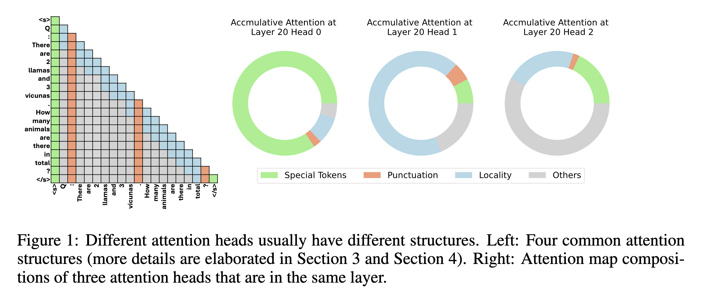

### FastGen: Model Tells You What to Discard: Adaptive KV Cache Compression for LLMs

## Authors and Affiliations
- **Suyu Ge** (University of Illinois Urbana-Champaign)
- **Yunan Zhang** (University of Illinois Urbana-Champaign)
- **Liyuan Liu** (Microsoft)
- **Minjia Zhang** (Microsoft)
- **Jiawei Han** (University of Illinois Urbana-Champaign)
- **Jianfeng Gao** (Microsoft)
- Emails: {suyuge2, yunanz2, hanj}@illinois.edu, {lucliu, minjiaz, jfgao}@microsoft.com

## Abstract
FastGen is an adaptive KV cache compression method for large language models (LLMs). It uses lightweight profiling to identify intrinsic attention structures, adapting KV cache policies accordingly to reduce memory consumption without significant loss in generation quality. FastGen achieves substantial GPU memory reduction and negligible quality loss, supporting up to 35% cache compression while retaining over 95% of attention scores.

## Introduction
- **Context**: LLMs face memory constraints due to large KV caches. Offloading techniques mitigate this but introduce latency.
- **Solution**: FastGen compresses KV caches by profiling attention patterns and applying targeted compression policies.

## Methodology
### Adaptive KV Cache Compression
1. **Profiling Algorithm**: Identifies attention structures in LLMs, guiding cache construction.
2. **KV Cache Construction**: Applies compression policies based on profiling, reducing memory usage.

### KV Cache Compression Policies
- **Special Tokens**: Retains only special tokens in KV cache.
- **Punctuation**: Retains only punctuation tokens.
- **Locality**: Evicts long-range contexts, keeping only local ones.
- **Frequency (Heavy Hitter)**: Retains frequently attended tokens.

### Hybrid Policies
- Combines multiple compression policies to optimize KV cache usage.

## Experiments
### Performance Evaluation
- **Models**: Evaluated on Llama 1 and its fine-tuned variants (7B to 65B parameters).
- **Tasks**: Tested on benchmarks like GSM8k, HumanEval, NQ, and TQA.
- **Results**: FastGen achieves up to 40% memory reduction with minimal performance loss.

### Memory Footprint and Latency
- **Memory Reduction**: Significant reductions in KV cache memory across all model sizes.
- **Latency Improvement**: FastGen reduces end-to-end latency by up to 55% compared to baselines.

### Profiling Cost
- **Efficiency**: Profiling overhead is minimal, less than 0.35% of total generation duration.

## Conclusion
FastGen offers an efficient solution for KV cache compression in LLMs, achieving substantial memory and latency improvements with minimal quality degradation. It is a plug-and-play method requiring no retraining.

## Repository
For more information and access to the code, visit the [GitHub repository](https://github.com/FastGen/KV-cache).