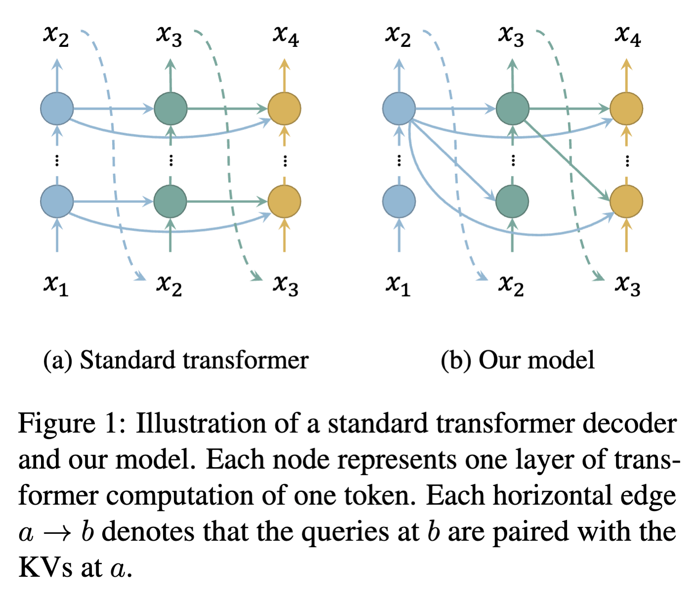

### Layer-Condensed KV Cache for Efficient Inference of Large Language Models

## Authors and Affiliations
- **Haoyi Wu** (School of Information Science and Technology, ShanghaiTech University)
- **Kewei Tu** (School of Information Science and Technology, ShanghaiTech University, Shanghai Engineering Research Center of Intelligent Vision and Imaging)
- Emails: {wuhy1, tukw}@shanghaitech.edu.cn

## Abstract
This paper presents a novel method to reduce the memory consumption of the key-value (KV) cache in large language models (LLMs). By computing and caching the KVs of only a small number of layers, the proposed method achieves up to 26× higher throughput compared to standard transformers while maintaining competitive performance in language modeling and downstream tasks. The method is orthogonal to existing memory-saving techniques and can be integrated with them for further improvements in inference efficiency.

## Introduction
- **Context**: High memory consumption of LLMs, especially the KV cache, limits their deployment in real-world applications.
- **Solution**: Propose a new transformer variant that reduces the number of layers for which KVs are computed and cached, significantly saving memory and improving throughput.

## Methodology
### Model
- **Layer-Condensed KV Cache**: Pairs queries of all layers with KVs of only the top layer, reducing memory consumption.
- **Self-Attention Modification**: Drops the attention of each token to itself by masking the diagonal of the attention matrix.
- **Warmup Layers**: Retains standard attention for a small number of layers to maintain performance.

### Training
- **Parallel Training**: Derives an approximate method to support parallel training despite sequential dependencies.
- **Gradient Stopping**: Stops gradients after a few iterations to manage memory consumption during backpropagation.
- **Fast Convergence of KV**: Uses a smaller number of iterations to approximate the KVs, reducing training and inference time.

## Experiments
### Generation Throughput
- **Setup**: Tested with 1.1B, 7B, and 30B parameter models on NVIDIA GPUs.
- **Results**: Achieves significantly larger batch sizes and higher throughput compared to standard transformers.

### Model Performance
- **Tasks**: Language modeling and commonsense reasoning tasks.
- **Results**: Comparable performance to standard transformers with significant improvements in throughput.

### Integration with StreamingLLM
- **Combined Method**: Integrates with StreamingLLM to further enhance efficiency.
- **Results**: Lower latency and memory consumption compared to original StreamingLLM.

## Conclusion
The proposed method reduces memory consumption and improves throughput for LLMs by reducing the number of layers with computed and cached KVs. It achieves significant efficiency gains with minimal performance degradation and can be combined with other memory-saving techniques for further improvements.

## Repository
For more information and access to the code, visit the [GitHub repository](https://github.com/whyNLP/LCKV).