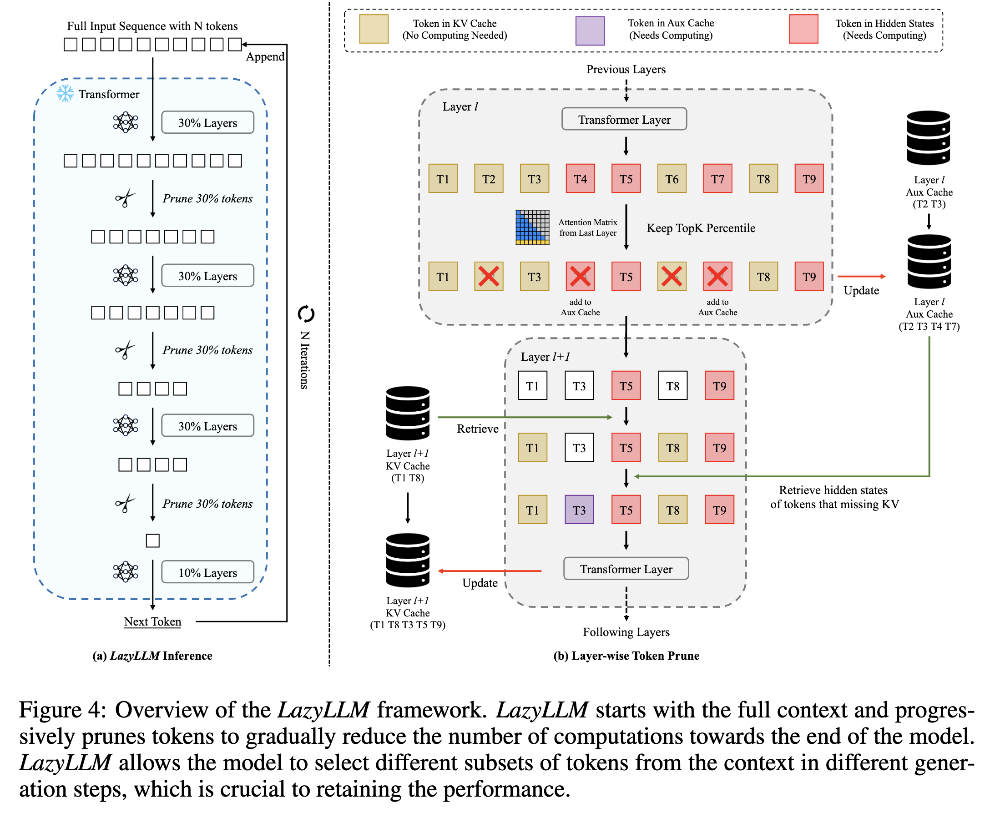

### LazyLLM: Dynamic Token Pruning for Efficient Long Context LLM Inference

## Authors and Affiliations
- **Qichen Fu** (Apple)
- **Minsik Cho** (Apple)
- **Thomas Merth** (Apple)
- **Sachin Mehta** (Apple)
- **Mohammad Rastegari** (Meta AI)
- **Mahyar Najibi** (Apple)

## Abstract
LazyLLM is a novel dynamic token pruning method designed to accelerate large language model (LLM) inference, specifically targeting the reduction of time-to-first-token (TTFT). By selectively computing key-value (KV) cache for important tokens and deferring the computation of others, LazyLLM significantly optimizes the prefilling stage. This method achieves a 2.34× speedup in the prefilling stage for the LLaMA 2 7B model on multi-document QA tasks, maintaining high accuracy without requiring fine-tuning.

## Introduction
- **Problem**: Long prompt sequences in LLMs lead to high computational costs during the prefilling stage, increasing TTFT.
- **Solution**: LazyLLM dynamically prunes tokens based on their importance, reducing unnecessary computations and accelerating inference.

## Methodology

### Dynamic Token Pruning
- **Token Importance**: Uses attention scores from the previous layer to determine token importance for the next token prediction.
- **Progressive Pruning**: Prunes tokens progressively across transformer layers, allowing the model to dynamically select different token subsets at each generation step.

### Aux Cache
- **Auxiliary Cache**: Stores hidden states of pruned tokens, enabling efficient retrieval and preventing repetitive computations when tokens are needed in later steps.

## Experiments
### Evaluation
- **Datasets**: LongBench, encompassing tasks like single-doc QA, multi-doc QA, summarization, few-shot learning, synthetic tasks, and code completion.
- **Models**: Tested on LLaMA 2 7B and XGen 7B models.

### Results
- **TTFT Speedup**: LazyLLM consistently achieves significant TTFT speedups with minimal accuracy loss across various tasks.
- **Generation Speedup**: Also improves overall generation speed, reducing the percentage of prompt tokens computed and enhancing efficiency.

### Comparative Performance
- **Baselines**: Outperforms baselines like random token drop, static token pruning, and prompt compression in both speed and accuracy.

## Conclusion
LazyLLM effectively reduces TTFT and enhances inference efficiency in LLMs by dynamically pruning tokens. This method is training-free and seamlessly integrates with existing models, providing substantial performance improvements for long-context tasks.

## Repository
For more information and access to the code, visit the [GitHub repository](https://github.com/LazyLLM).