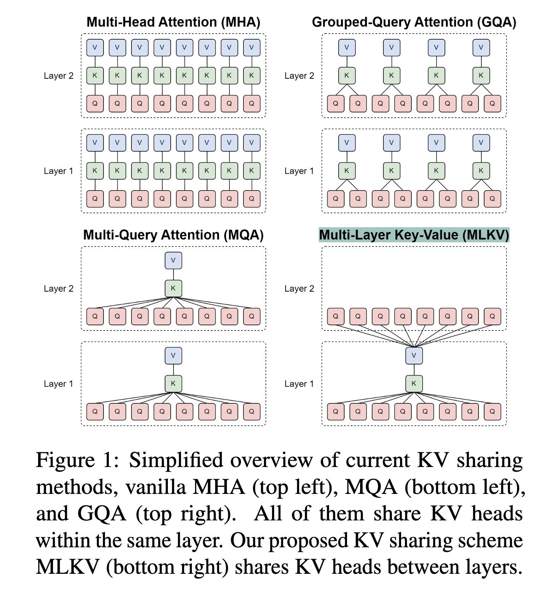

### MLKV: Multi-Layer Key-Value Heads for Memory Efficient Transformer Decoding

## Authors and Affiliations
- **Zayd Muhammad Kawakibi Zuhri** (Institut Teknologi Bandung)
- **Muhammad Farid Adilazuarda** (MBZUAI)
- **Ayu Purwarianti** (Institut Teknologi Bandung)
- **Alham Fikri Aji** (MBZUAI)

## Abstract
MLKV (Multi-Layer Key-Value) introduces a new approach to Key-Value (KV) sharing in transformers, extending sharing across multiple layers to reduce memory usage beyond existing methods like Multi-Query Attention (MQA) and Grouped-Query Attention (GQA). MLKV can reduce KV cache size by up to 6x compared to MQA, with minimal performance degradation. Experiments on various NLP benchmarks demonstrate its potential for efficient transformer model deployment at scale.

## Introduction
- **Problem**: KV caching in transformers leads to significant memory bottlenecks, especially as model size and sequence length increase.
- **Solution**: MLKV shares KV heads not only within the same layer (as in MQA and GQA) but also across multiple layers, leading to more substantial memory savings.

## Methodology
### Multi-Layer Key-Value (MLKV) Sharing
- **KV Head Sharing**: Extends KV sharing across multiple layers, allowing a single KV head to serve multiple layers, reducing the overall KV cache size.
- **Uptraining Strategy**: Uses an uptraining scheme from GQA to adapt existing transformer checkpoints to the MLKV configuration.

### Implementation
- **Configurations**: Tested with various configurations, adjusting the number of layers that share KV heads.
- **Mathematical Representation**: Defines the KV cache size based on the number of layers sharing the KV heads, with the potential to reduce the cache size to a fraction of its original size.

## Experiments
### Setup
- **Models**: Used Pythia-160M variants as the base models, uptrained with different KV sharing configurations.
- **Data**: Utilized a deduplicated version of The Pile dataset for uptraining.

### Results
- **Benchmarking**: Evaluated on ARC-e, LAMBADA, PIQA, and SciQ. MLKV shows a trade-off between memory savings and accuracy, with higher savings leading to some performance degradation.
- **Inference Time Measurements**: MLKV demonstrates significant memory savings, allowing for larger batch sizes or longer sequences, though without a significant speedup in throughput.

## Conclusion
MLKV offers a promising approach to reducing KV cache size in transformers, particularly for memory-constrained scenarios. By sharing KV heads across multiple layers, it provides substantial memory savings with a manageable trade-off in accuracy, making it suitable for scalable transformer model deployment.

## Repository
For more information and access to the code, visit the [GitHub repository](https://github.com/zaydzuhri/pythia-mlkv).