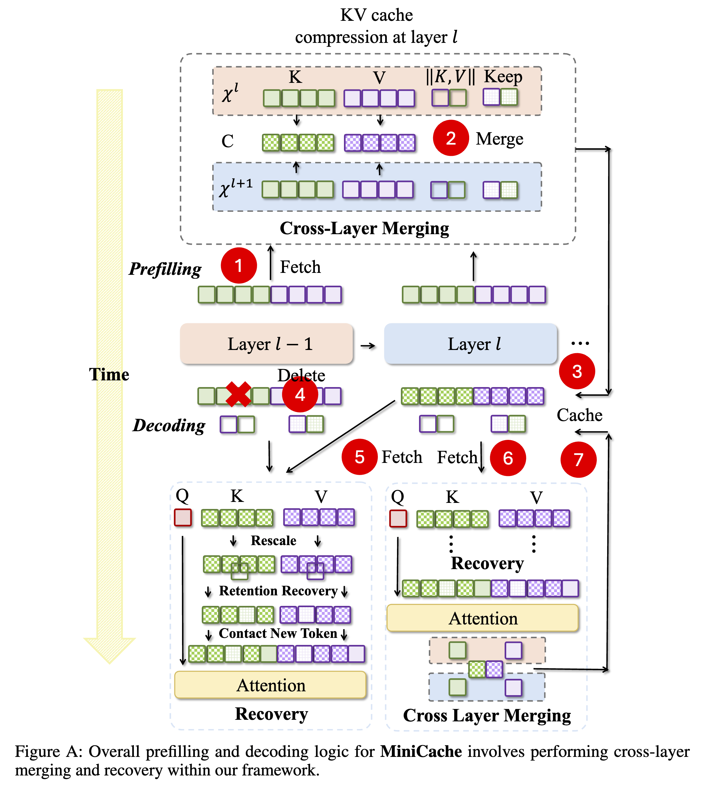

### MiniCache: KV Cache Compression in Depth Dimension for Large Language Models

## Authors and Affiliations
- **Akide Liu**
- **Jing Liu**
- **Zizheng Pan**
- **Yefei He**
- **Gholamreza Haffari**
- **Bohan Zhuang**
- Affiliations: ZIP Lab, Monash University, Australia; ZIP Lab, Zhejiang University, China

## Abstract
MiniCache is a KV cache compression method for large language models (LLMs) that reduces memory footprint by compressing the KV cache across layers from a depth perspective. By leveraging the high similarity of KV cache states between adjacent layers, MiniCache achieves up to 5.02× compression ratio, enhances inference throughput by 5×, and reduces memory usage by 41%, maintaining near-lossless performance.

## Introduction
- **Context**: Large KV caches in LLMs lead to increased memory usage, posing challenges for long-context applications.
- **Solution**: MiniCache compresses the KV cache across layers, reducing redundancy and improving memory efficiency.

## Methodology
### KV Cache Compression
- **Cross-Layer Redundancy**: KV cache states exhibit high similarity between adjacent layers, especially in middle-to-deep layers.
- **Merging Strategy**: Uses reparameterization to merge KV states, preserving their magnitudes while interpolating directions.

The detailed execution process is shown in Figure A:

1. **KV Cache Retrieval**: In the Prefill phase, generate the KV Cache layer by layer.
2. **Cross-Layer Merging**: When reaching the starting layer S for merging, combine the KV Cache of the current layer L with that of the previous layer L-1 to reduce redundancy.
3. **Caching**: Store the merged KV Cache for future use.
4. **Deletion**: In the Decoding phase, remove unnecessary or redundant KV Cache to optimize memory usage.
5. **Loading and Generation**: Retrieve the required KV Cache for output generation.
6. **Restoration**: Apply error suppression mechanisms, including rescaling and retention recovery, to the retrieved KV Cache to minimize errors introduced during merging and compression.
7. **Updating**: After the restoration phase, use the final KV Cache to update the shared KV Cache.

### Token Retention
- **Retention Strategy**: Identifies and retains highly distinct token pairs that are unsuitable for merging, minimizing performance degradation.

### Implementation
- **Reparameterization-Based Merging**: Decomposes state vectors into magnitude and direction components, merging them using spherical linear interpolation (SLERP).

## Experiments
### Evaluation
- **Datasets**: Tested on GSM8K, COQA, TruthfulQA, and LongBench.
- **Models**: Evaluated on LLaMA-2, LLaMA-3, Phi-3, Mistral, and Mixtral models.
- **Results**: Achieved up to 5.02× compression ratio and 5× throughput improvement with minimal performance loss.

### Efficiency Analysis
- **Memory Usage**: Significantly reduced memory footprint compared to full cache baselines.
- **Throughput**: Improved throughput, enabling larger batch sizes and faster inference.

## Conclusion
MiniCache effectively compresses KV caches in LLMs, offering substantial memory savings and throughput improvements while maintaining high performance. The method is training-free and complements existing KV cache compression techniques.

