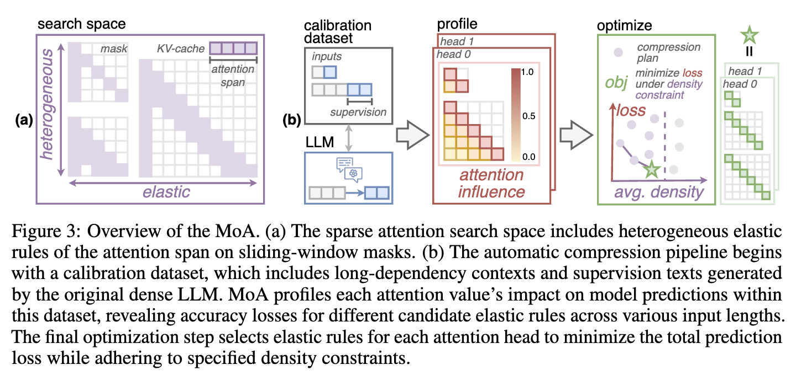

### Mixture of Sparse Attention for Automatic Large Language Model Compression

## Authors and Affiliations
- **Tianyu Fu**, **Haofeng Huang**, **Xuefei Ning**, **Genghan Zhang**, **Boju Chen**, **Tianqi Wu**, **Hongyi Wang**, **Zixiao Huang**, **Shiyao Li**, **Shengen Yan**, **Guohao Dai**, **Huazhong Yang**, **Yu Wang**
- Affiliations: 
  - Tsinghua University
  - Infinigence-AI
  - Stanford University
  - Shanghai Jiao Tong University

## Abstract
MoA (Mixture of Attention) proposes a method for automatically tailoring distinct sparse attention configurations to different heads and layers in large language models (LLMs). This method profiles the model, evaluates potential configurations, and determines the optimal sparse attention plan. MoA increases the effective context length by 3.9×, enhances retrieval accuracy by 1.5−7.1×, reduces GPU memory usage by 1.2−1.4×, and boosts throughput by 5.5−6.7× with minimal performance impact.

## Introduction
- **Context**: LLMs demand significant memory and computational resources, particularly with growing input lengths.
- **Problem**: Uniform sparse attention masks fail to capture the diverse attention patterns in LLMs, leading to inefficiencies.
- **Solution**: MoA addresses this by constructing a search space of various attention patterns and their scaling rules, automatically finding the optimal sparse attention configuration.

## Methodology

### Heterogeneous Attention Patterns and Elastic Rules
- **Observation**: Different attention heads exhibit heterogeneous patterns and varying elastic behaviors as input length changes.
- **Search Space**: MoA formulates a diverse range of elastic rules for each attention head and layer, optimizing the attention span relative to input length.

### Automatic Pipeline for MoA Compression
1. **Profiling**: Measures the influence of each attention value on the model’s prediction loss using a calibration dataset.
2. **Optimization**: Selects the optimal elastic rule for each head to minimize accuracy loss while adhering to density constraints.

### Algorithm Pseudo Code
```markdown
Algorithm 1: One forward pass in MoA
Input: Attention matrix A, gradients ∂L/∂A
Output: Optimized compression plan

for head h ∈ heads do
    for length N ∈ lengths do
        Profile influence: Eh = ∑(∂L/∂A) * ΔA
        Optimize elastic rule: min ∆L under density constraint
    end for
end for
```

## Experiments
### Performance Evaluation
- **Models**: Vicuna-7B, Vicuna-13B, Llama3-8B
- **Tasks**: LongBench, LV-Eval, retrieval accuracy
- **Results**: MoA achieves up to 6.7× throughput improvement and 54% GPU memory reduction, maintaining high retrieval accuracy and performance on long-context tasks.

### Ablation Studies
- **Impact of Elastic Rules**: Demonstrates the importance of heterogeneous elastic rules in enhancing performance and efficiency.
- **Dataset and Supervision**: Using model-generated summaries for calibration improves profiling accuracy and compression results.

## Conclusion
MoA effectively compresses LLMs by tailoring sparse attention masks to individual attention heads and layers. This method significantly enhances memory efficiency and throughput while maintaining high performance, making it suitable for long-context applications.

## Repository
For more information and access to the code, visit the [GitHub repository](https://github.com/thu-nics/MoA).