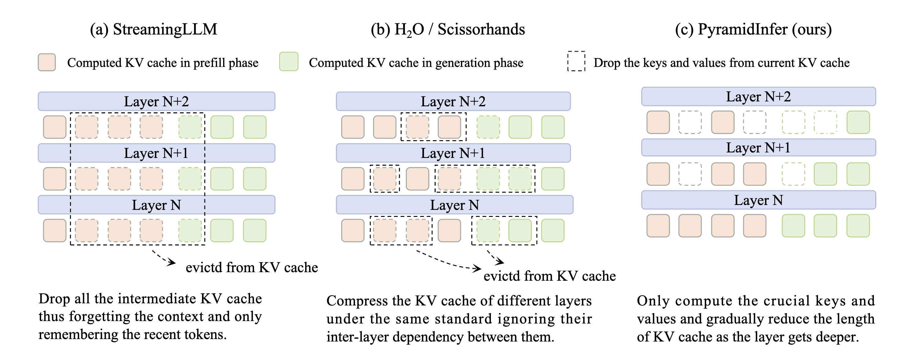

### PyramidInfer: Pyramid KV Cache Compression for High-Throughput LLM Inference

## Authors and Affiliations
- **Dongjie Yang** (Shanghai Jiao Tong University)
- **Xiaodong Han** (Xiaohongshu Inc.)
- **Yan Gao** (Xiaohongshu Inc.)
- **Yao Hu** (Xiaohongshu Inc.)
- **Shilin Zhang** (South China University of Technology)
- **Hai Zhao** (Shanghai Jiao Tong University)

## Abstract
PyramidInfer is a KV cache compression method that reduces GPU memory usage during inference by layer-wise retaining crucial context information. It leverages the consistency of attention weights to identify and retain important keys and values, achieving significant memory savings without performance loss. PyramidInfer improves throughput by 2.2x and reduces GPU memory usage by 54%.

## Introduction
- **Problem**: High GPU memory usage during LLM inference hinders scalability.
- **Solution**: PyramidInfer compresses KV cache by retaining crucial context information across layers, reducing memory consumption and improving throughput.

## Methodology
### Observations
- **Inference Context Redundancy (ICR)**: Only the last token needs to predict the next token during inference, leading to redundant information in keys and values.
- **Recent Attention Consistency (RAC)**: Recent tokens consistently attend to the same context keys and values, enabling effective KV cache compression.

### PyramidInfer Algorithm
- **Prefill Phase**: Retains pivotal contexts (PvCs) for each layer, reducing memory usage before token generation.
- **Generation Phase**: Updates PvCs based on recent tokens, maintaining a sliding window of context information.

### Algorithm Pseudo Code
```markdown
Algorithm 1: One forward pass in PyramidInfer
Input: KV cache KV, recent window length L, min PvC length N = {N0, ..., Nl, ...}
Output: updated KV cache KV

for layer l ∈ layers do
    if KV is not None then
        KV = cat([PvCpast, KV])
    A ← compute attention weights of KV
    Ae ← weighted_avg(A[−L :, : −L], dim = −2)
    if len(KV) > Nl then
        TopP_index ← TopP(Ae, p = p)
        PvC ← Gather(KV, index = TopP_index)
        KV ← PvC
    Reduce p by multiplying a decay ratio
return KV
```

## Experiments
### Basic Evaluation
- **Tasks**: Language modeling, LLM benchmarks, conversation, long context summarization.
- **Models**: LLaMA 2, Vicuna, CodeLLaMA.
- **Results**: PyramidInfer maintains high performance with significantly reduced memory usage and improved throughput.

### Efficiency Analysis
- **Memory Reduction**: Up to 54.6% less GPU memory usage.
- **Throughput Improvement**: Up to 2.24x higher throughput compared to baseline methods.

### Ablation Studies
- **PvC Length Decay**: Gradually reducing PvC length in deeper layers maximizes efficiency while maintaining performance.
- **Recent Sequence Ratio**: Balancing the proportion of recent tokens improves memory usage and performance.

## Conclusion
PyramidInfer effectively compresses the KV cache in LLMs, offering substantial memory savings and throughput improvements. It leverages attention consistency to identify and retain crucial context information, making it suitable for resource-constrained environments.

## Repository
For more information and access to the code, visit the [GitHub repository](https://github.com/mutonix/pyramidinfer).