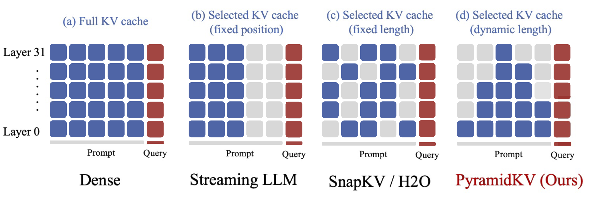
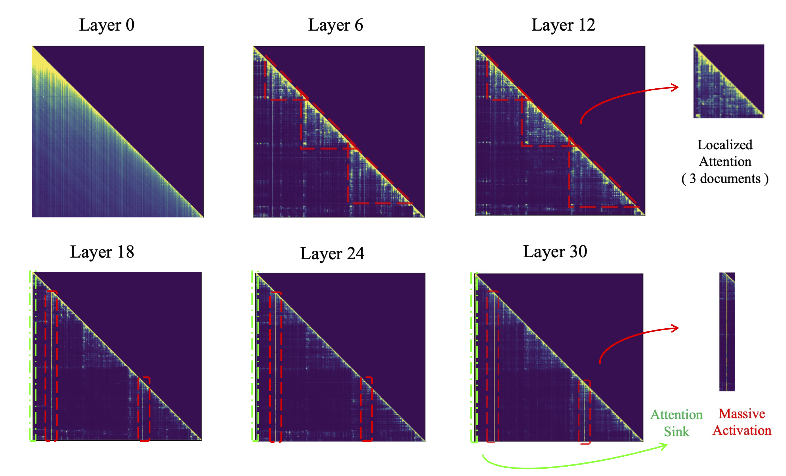
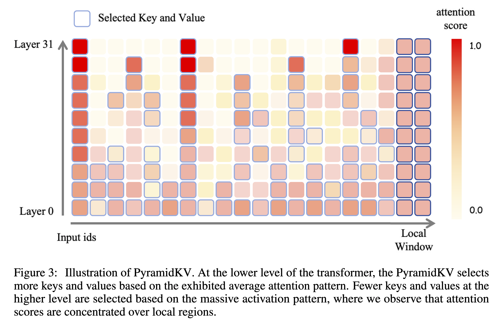

### PyramidKV: Dynamic KV Cache Compression Based on Pyramidal Information Funneling

## Authors and Affiliations
- **Zefan Cai** (University of Wisconsin - Madison)
- **Yichi Zhang** (Peking University)
- **Bofei Gao** (Peking University)
- **Yuliang Liu** (Nanjing University)
- **Tianyu Liu** (Qwen)
- **Keming Lu** (Qwen)
- **Wayne Xiong** (Microsoft)
- **Yue Dong** (University of California - Riverside)
- **Baobao Chang** (Peking University)
- **Junjie Hu** (University of Wisconsin - Madison)
- **Wen Xiao** (Microsoft)

## Abstract
PyramidKV is a novel KV cache compression method designed to enhance the efficiency of large language models (LLMs) in handling long contexts. By dynamically adjusting KV cache sizes across different layers, PyramidKV allocates more cache to lower layers where information is widely dispersed and less to higher layers where information is concentrated. This method matches the performance of models with a full KV cache while retaining only 12% of the KV cache, significantly reducing memory usage.

## Introduction
- **Context and Motivation**: Large language models (LLMs) face challenges with long context processing due to quadratic attention computation. Maintaining a full KV cache for long contexts requires extensive memory, posing efficiency constraints.
- **Previous Solutions**: Prior methods, such as low-rank decomposition and pruning, offer some improvements but typically use a fixed KV cache size across layers.
- **Pyramidal Information Funneling**: Analysis shows that attention in LLMs follows a pyramidal pattern—scattering widely in lower layers and focusing on key tokens in higher layers. This pattern inspired PyramidKV, which dynamically allocates KV cache sizes based on this funneling behavior.

## Methodology
### Preliminaries and Problem Formulation
- **KV Cache**: The key (K) and value (V) matrices store attention information. The goal is to compress these matrices while preserving model performance.
- **PyramidKV**: Allocates varying KV cache sizes across layers to match attention patterns. Lower layers receive more cache due to dispersed information, while higher layers receive less cache due to concentrated information.

### KV Cache Size/Budget Allocation
- **Fixed Size Limitations**: Previous methods retain a fixed KV cache size across layers, leading to inefficiencies.
- **Dynamic Allocation**: PyramidKV increases cache in lower layers and decreases it in higher layers, reflecting the decreasing importance of tokens as they move up the layers.
- **Implementation**: Cache sizes are determined using an arithmetic sequence, ensuring more cache at lower layers.

### KV Cache Selection
- **Retention of Instruction Tokens**: The last few tokens of the input, which often contain crucial information, are retained across all layers.
- **Attention-Guided Selection**: Important tokens are selected based on attention scores derived from instruction tokens. The KV states of these tokens are retained in the cache.

## Experiments
### Performance Evaluation
- **Datasets**: LongBench with 17 datasets across various tasks and domains, including single-document QA, multi-document QA, summarization, few-shot learning, and code generation.
- **Models**: Evaluated on LLaMa-3-8B and Mistral-7B.
- **Results**: PyramidKV matches the performance of full KV cache models while using only 12% of the cache. In extreme conditions with only 0.7% of the cache, PyramidKV significantly outperforms other compression methods, achieving up to a 20.5 absolute accuracy improvement on TREC.

### Memory Efficiency
- **Memory Reduction**: PyramidKV reduces memory usage by adjusting cache sizes dynamically, leading to substantial memory savings without significant performance drops.
- **Comparative Performance**: Outperforms baseline models (H2O, SnapKV, StreamingLLM) across all tested cache sizes, with advantages most pronounced in smaller cache sizes.

## Conclusion
PyramidKV effectively compresses the KV cache in LLMs by leveraging the pyramidal information funneling pattern observed in attention mechanisms. This method reduces memory usage significantly while maintaining high performance, particularly in memory-constrained scenarios.

## Future Work
- **Dynamic Adjustment**: Further optimization by adjusting KV cache sizes based on real-time attention dynamics within LLMs.
- **In-Context Learning**: Exploration of KV cache applications in few-shot learning tasks to enable the use of more shots within constrained memory limits.

## Repository
For more information and access to the code, visit the [GitHub repository](https://zefan-cai.github.io/PyramidKV.github.io/).