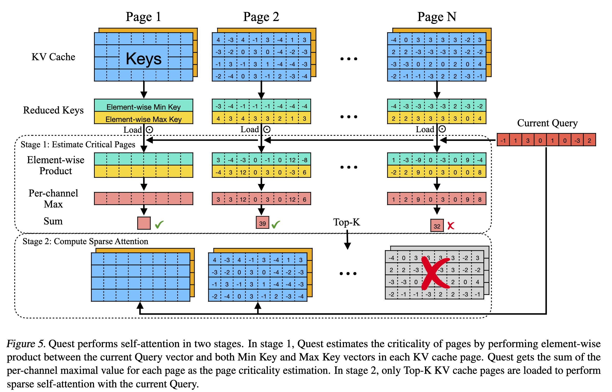

### Quest: Query-Aware Sparsity for Efficient Long-Context LLM Inference

## Authors and Affiliations
- **Jiaming Tang** (Shanghai Jiao Tong University, MIT)
- **Yilong Zhao** (Shanghai Jiao Tong University, University of Washington)
- **Kan Zhu** (University of Washington)
- **Guangxuan Xiao** (MIT)
- **Baris Kasikci** (University of Washington)
- **Song Han** (MIT, NVIDIA)

## Abstract
Quest is a query-aware KV cache selection algorithm designed to accelerate long-context LLM inference. By estimating the criticality of KV cache pages based on query vectors and loading only the most critical pages, Quest achieves up to 7.03× self-attention speedup, reducing inference latency by 2.23× with negligible accuracy loss. Quest demonstrates high performance on tasks requiring long-context dependencies and is validated on several benchmarks including PG19, passkey retrieval, and LongBench.

## Introduction
- The demand for long-context LLMs has led to context windows extending up to 1M tokens.
- Long-context LLM inference is challenging due to the large KV cache requirements, slowing down self-attention.
- Previous methods identified critical tokens based on static criteria, but Quest dynamically determines token criticality based on the current query, significantly improving efficiency.

## Methodology
### Breakdown of Inference Cost
- LLM inference consists of the prefill stage (embedding input tokens and generating KV cache) and the decode stage (generating the response token by token).
- The decode stage dominates inference time, especially in long-context scenarios where the KV cache must be loaded repeatedly.


### Quest Algorithm
1. **Criticality Estimation**:
   - Each KV cache page is represented by its minimal and maximal key values.
   - The criticality of a page is estimated by computing the element-wise product of these values with the query vector and summing the maximal values.

2. **Selecting Critical Pages**:
   - Quest selects the top-K pages with the highest criticality scores to perform approximate self-attention.
   - This reduces memory movement and speeds up inference.

3. **Sparse Self-Attention**:
   - Only the selected top-K pages are loaded for self-attention, reducing the need to load the entire KV cache.

### Efficiency and Accuracy
- Quest maintains high accuracy by dynamically selecting critical tokens based on the query, unlike static methods that may discard important tokens.
- Quest achieves substantial speedups by reducing memory movement, demonstrating efficient long-context inference.


### Section 3.4: Dynamically Estimating Token Criticality

In this section, the authors describe the core mechanism of Quest for dynamically estimating the criticality of tokens in the KV cache based on the current query vector. This process is crucial for efficiently selecting the most relevant tokens for self-attention, thereby reducing the computational burden and improving inference speed without sacrificing accuracy.

#### Key Points:

1. **Dynamic Criticality**:
   - The criticality of a token depends heavily on the query vector \( Q \). Different queries can change which tokens are critical.
   - For example, in a prompt "A is B. C is D. A is", the token "B" becomes critical when queried by "is" because it is the expected continuation. Before the final token "is", "B" might not be critical.

2. **Approximate Attention Score Calculation**:
   - To estimate the criticality of tokens, Quest uses an approximate method.
   - Each page of the KV cache has metadata that includes the minimal and maximal values of each feature dimension of the Key vectors. This metadata helps estimate the upper bound of the attention weights.
   - By using the minimal (\( m_i \)) and maximal (\( M_i \)) values of Key vectors, Quest calculates an approximate attention score that represents the potential importance of each token.

3. **Efficiency**:
   - Instead of computing the exact attention for all tokens, which is computationally expensive, Quest uses these upper bound estimates to quickly identify and select the most critical tokens (Top-K pages).
   - This reduces the amount of data loaded and processed during self-attention, significantly speeding up the inference.

### Algorithm 1: Token Criticality Estimation

The algorithm outlines the steps for estimating the criticality of tokens in the KV cache using metadata and query vectors. The process involves two main parts: updating the metadata when a new token is added and calculating the criticality during self-attention.

#### Algorithm Breakdown:

1. **Updating Metadata for New Tokens**:
   - When a new token is inserted into the KV cache, its Key vector \( k_i \) is compared with the existing minimal and maximal vectors (\( m_i \) and \( M_i \)) for each dimension.
   - The minimal and maximal vectors are updated to ensure they reflect the range of values in the current page.

2. **Estimating Criticality During Self-Attention**:
   - When performing self-attention, the algorithm uses the Query vector \( Q \) and the metadata (minimal and maximal vectors) to estimate the criticality of each page.
   - For each dimension, it calculates the maximum possible product of \( Q \) with the minimal and maximal values of the Key vectors.
   - These products are summed to get an upper bound score representing the criticality of the page.

#### Algorithm 1:

```markdown
Algorithm 1: Token Criticality Estimation

When inserting new token to KV cache:
Input: Key vector K, Dimension of hidden states dim,
       Current maximal vector Mi, Current minimal vector mi

for i = 1 to dim do
    Mi = max(Mi, ki)
    mi = min(mi, ki)
end for

When performing self-attention:
Input: Query vector Q, Dimension of hidden states dim,
       Current maximal vector Mi, Current minimal vector mi

Initialize score = 0.
for i = 1 to dim do
    score += max(Qi * Mi, Qi * mi)
end for
```

### Example to Illustrate

Consider a scenario where we are processing the following sequence:

```
Prompt: "The cat sat on the mat. The mat is"
Expected token: "clean"
```

1. **Updating Metadata**:
   - Suppose we insert the token "clean" with its Key vector \( K \). The minimal (\( m_i \)) and maximal (\( M_i \)) vectors are updated based on the values in \( K \).

2. **Estimating Criticality**:
   - During self-attention, the Query vector \( Q \) is compared with the metadata.
   - For each dimension \( i \), the algorithm calculates \( max(Q_i * M_i, Q_i * m_i) \).
   - These values are summed to get an upper bound score for each page, indicating the criticality of the tokens in that page.

By following this process, Quest efficiently determines which pages of the KV cache contain the most critical tokens for the current query, significantly reducing the computational load and speeding up inference without compromising on the accuracy of the model's predictions.

### Section 3.5: Quest Reduces the Memory Movement of Self-Attention

In this section, the authors discuss how Quest reduces memory movement during the self-attention process by leveraging query-aware sparsity. This reduction is significant for improving the efficiency of long-context LLM inference.

#### Key Points:

1. **Memory Movement in Self-Attention**:
   - During self-attention, loading the entire KV cache is a major contributor to inference latency. For large context lengths, the KV cache can be enormous, making this step very time-consuming.

2. **Query-Aware Sparsity**:
   - Quest reduces the amount of data that needs to be loaded by dynamically selecting only the most critical KV cache pages based on the current query.
   - Instead of loading the whole KV cache, Quest estimates the criticality of pages and selects only the top-K pages for detailed self-attention processing.

3. **Calculation of Memory Load Reduction**:
   - Assume each Key or Value vector is \(M\) bytes.
   - The KV cache contains \(L\) tokens, and each page contains \(S\) KV pairs.
   - During criticality estimation, Quest loads the minimal and maximal vectors of each page, which is

 approximately \(2M \cdot L/S\) bytes.
   - Quest performs normal self-attention for the top-K pages, which adds \(2M \cdot K \cdot S\) bytes.
   - The total KV cache size is \(2M \cdot L\) bytes.
   - Therefore, the memory load by Quest is reduced to \(1/S + K/L\) of the total KV cache, which is a significant reduction.

### Example Calculation

So the memory load reduction is:
\[ \frac{1}{16} + \frac{4K}{64K} = \frac{1}{16} + \frac{1}{16} = \frac{1}{8} \]

This means Quest reduces the memory load to 1/8th of the total KV cache size, providing an 8× reduction in memory movement.

#### Summary of Benefits

- **Significant Speedup**: By loading only a fraction of the KV cache, Quest achieves substantial speedups in self-attention latency.
- **Universal Reduction**: The memory load reduction is universal across different models and compatible with existing quantization techniques.
- **Practical Efficiency**: Quest's query-aware approach ensures that only the most relevant data is processed, maintaining high accuracy with reduced computational overhead.
  
## Experiments
### Datasets and Implementation
- Evaluated on PG19 (language modeling), passkey retrieval task, and six datasets in LongBench (e.g., NarrativeQA, HotpotQA).
- Models used: LongChat-v1.5-7b-32k and Yarn-Llama-2-7b-128k.
- Compared against KV cache eviction algorithms H2O, TOVA, and StreamingLLM.

### Accuracy and Efficiency Evaluation
- **PG19**: Quest closely matches the performance of the full KV cache model, demonstrating effective handling of long-context dependencies.
- **Passkey Retrieval**: Quest maintains high accuracy with minimal KV cache budget, outperforming static methods.
- **LongBench**: Quest consistently outperforms baselines across various long-context datasets, achieving lossless performance with significantly reduced token budgets.

### Kernel and End-to-End Performance
- **Kernel Evaluation**: Quest's criticality estimation, Top-K filtering, and approximate attention kernels show significant latency reductions.
- **End-to-End Evaluation**: Quest achieves up to 2.23× speedup in end-to-end inference compared to FlashInfer, with improved performance as sequence length increases.

## Conclusion
Quest provides an efficient and accurate solution for long-context LLM inference by leveraging query-aware sparsity. It dynamically estimates token criticality, significantly reducing memory movement and inference latency without compromising accuracy. Comprehensive evaluations demonstrate Quest's superior performance and efficiency in handling long-context tasks.

## Repository
For more information and access to the code, visit the [GitHub repository](https://github.com/mit-han-lab/Quest).
