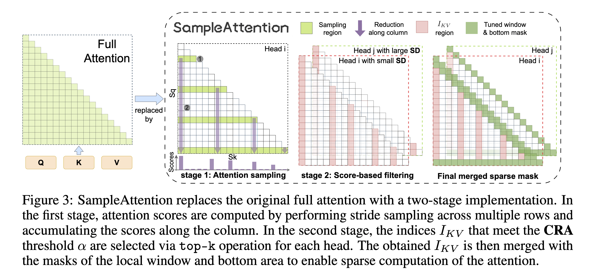

### SampleAttention: Adaptive Structured Sparse Attention for Long Context LLMs

## Authors and Affiliations
- **Qianchao Zhu**, **Jiangfei Duan**, **Chang Chen**, **Siran Liu**, **Xiuhong Li**, **Guanyu Feng**, **Xin Lv**, **Huanqi Cao**, **Chuanfu Xiao**, **Xingcheng Zhang**, **Dahua Lin**, **Chao Yang**
- Affiliations:
  - Peking University
  - The Chinese University of Hong Kong
  - Zhipu.AI
  - Tsinghua University
  - Shanghai AI Lab

## Abstract
SampleAttention introduces an adaptive structured sparse attention mechanism designed to reduce Time-to-First-Token (TTFT) latency for long-context LLMs without significant accuracy loss. By capturing head-specific sparse patterns and leveraging local window and column stripe structures, SampleAttention achieves up to 2.42× speedup compared to FlashAttention.

## Introduction
- **Problem**: Quadratic complexity of attention mechanisms in LLMs leads to high TTFT latency.
- **Solution**: SampleAttention reduces TTFT by dynamically capturing head-specific sparse patterns and employing structured sparse attention.

## Methodology

### Theoretical Foundation
- **Sparse Attention**: Demonstrates that attention scores in long contexts are inherently sparse and can be approximated with minimal accuracy loss.
- **Definitions**:
  - **Sparsity Degree (SD)**: Measures the percentage of key-value elements that can be dropped.
  - **Cumulative Residual Attention (CRA)**: Measures the minimum sum of remaining attention probabilities after sparsification.

### Empirical Foundation
- **Observations**:
  - High inherent sparsity in attention scores.
  - Significant variation in sparsity across heads and contexts.
  - Identification of local window and column stripe patterns as key structures.

### Adaptive Structured Sparse Attention
- **Two-Stage Query-Guided Key-Value Filtering**:
  1. **Attention Sampling**: Stride sampling of attention scores.
  2. **Key-Value Filtering**: Selects top key-value indices to meet the CRA threshold.
- **Implementation**:
  - Fixed window size as a percentage of sequence length.
  - Efficient hardware implementation to maximize IO-awareness and reduce overhead.

## Experiments
### Accuracy and Efficiency
- **Models**: Tested on ChatGLM2-6B and InternLM2-7B.
- **Tasks**: Evaluated on LongBench, BABILong, and Needle in a Haystack.
- **Results**: 
  - SampleAttention achieves near-lossless accuracy (>99% of full attention).
  - Significantly reduces TTFT and improves throughput.

### Hyperparameter Tuning
- **CRA Threshold (α)**: Balances between accuracy and speedup.
- **Local Window Size (rw%) and Sampling Ratio (rrow)**: Fine-tuned for optimal performance.

## Conclusion
SampleAttention effectively reduces TTFT for long-context LLMs by leveraging adaptive structured sparse attention. It maintains high accuracy while achieving significant speedup and memory efficiency, making it suitable for practical deployment in real-world applications.
