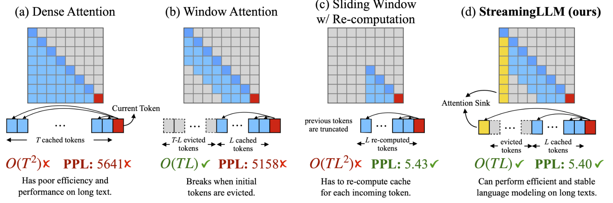

### Efficient Streaming Language Models with Attention Sinks

## Authors and Affiliations
- **Guangxuan Xiao** (Massachusetts Institute of Technology)
- **Yuandong Tian** (Meta AI)
- **Beidi Chen** (Carnegie Mellon University)
- **Song Han** (Massachusetts Institute of Technology, NVIDIA)
- **Mike Lewis** (Meta AI)

## Abstract
StreamingLLM is an efficient framework for deploying large language models (LLMs) in streaming applications without fine-tuning. It addresses two major challenges: excessive memory usage during decoding and the limited length extrapolation ability of existing LLMs. By keeping the KV of initial tokens (attention sinks), StreamingLLM maintains performance with long texts. It enables LLMs to handle up to 4 million tokens efficiently, achieving up to 22.2× speedup over sliding window re-computation.

## Introduction
- **Context and Motivation**: LLMs face challenges in multi-round dialogues and long interactions due to memory constraints and reduced performance with texts longer than the pre-training sequence length.
- **Attention Sinks**: Initial tokens in sequences act as "sinks" for attention, receiving high attention scores regardless of their relevance. This insight led to the development of StreamingLLM, which maintains these initial tokens to stabilize performance.

## Methodology
### Failure of Window Attention
- **Observations**: Window attention fails when the text length exceeds the cache size, as evicting initial tokens drastically increases perplexity.
- **Attention Sinks**: Initial tokens, regardless of their semantic importance, act as attention sinks, stabilizing the attention score distribution.

### StreamingLLM Framework
1. **Attention Sinks**: Retains a few initial tokens' KV to stabilize attention computation.
2. **Rolling KV Cache**: Maintains a rolling cache of the most recent tokens, crucial for language modeling.

### Pre-training with Attention Sinks
- **Method**: Introduces a learnable sink token during pre-training, effectively managing attention scores and enhancing streaming performance.

## Experiments
### Language Modeling on Long Texts
- **Models Evaluated**: Llama-2, Falcon, Pythia, MPT.
- **Results**: StreamingLLM matches the oracle baseline (sliding window with re-computation) in perplexity on long texts, handling up to 4 million tokens effectively.

### Efficiency Results
- **Benchmarks**: Compared with sliding window re-computation, StreamingLLM achieves up to 22.2× speedup in decoding latency with consistent memory usage.

### Real-world Application
- **Streaming Question Answering**: Evaluated on multi-round question-answering tasks, StreamingLLM performs comparably to one-shot baselines and outperforms window attention in accuracy.

## Conclusion
StreamingLLM provides a simple and efficient solution for deploying LLMs in streaming applications, handling infinite text lengths without fine-tuning. By leveraging attention sinks, it decouples the pre-training window size from actual text generation length, paving the way for efficient, long-context LLM deployments.

## Repository
For more information and access to the code, visit the [GitHub repository](https://github.com/mit-han-lab/streaming-llm) and [GitHub Repo 2](https://github.com/tomaarsen/attention_sinks).