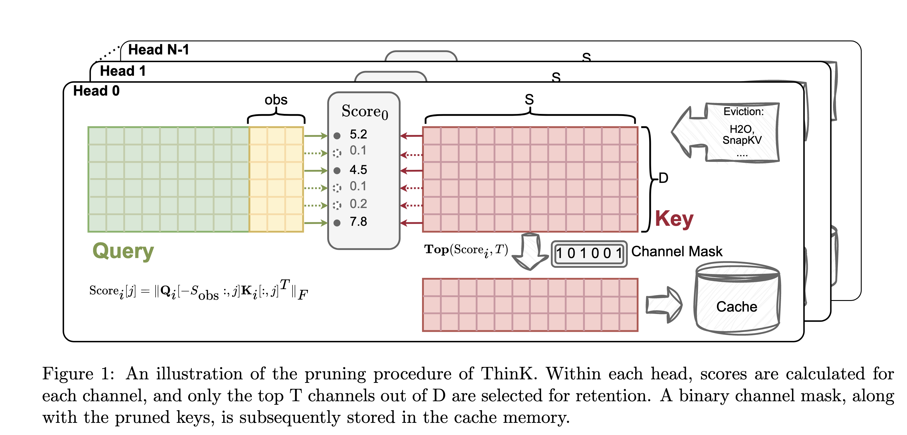

### ThinK: Thinner Key Cache by Query-Driven Pruning

## Authors and Affiliations
- **Yuhui Xu** (Salesforce AI Research)
- **Zhanming Jie** (Salesforce AI Research)
- **Hanze Dong** (Salesforce AI Research)
- **Lei Wang** (Salesforce AI Research)
- **Xudong Lu** (The Chinese University of Hong Kong)
- **Aojun Zhou** (The Chinese University of Hong Kong)
- **Amrita Saha** (Salesforce AI Research)
- **Caiming Xiong** (Salesforce AI Research)
- **Doyen Sahoo** (Salesforce AI Research)

## Abstract
ThinK introduces a novel query-driven pruning method to optimize the Key-Value (KV) cache for large language models (LLMs) during inference. This method selectively prunes the least significant channels in the key cache to reduce memory costs while maintaining or enhancing model accuracy. ThinK achieves over 20% reduction in memory usage compared to standard KV cache methods, with extensive evaluations on LLaMA3 and Mistral models confirming its efficacy in long-sequence tasks.

## Introduction
- **Context**: LLMs require substantial memory during inference, especially with long sequences, due to the quadratic complexity of the transformer attention mechanism.
- **Challenge**: Existing methods focus on pruning dimensions related to sequence length but overlook the channel dimension of the KV cache.
- **Solution**: ThinK addresses this by identifying and pruning redundant channels in the key cache, using a query-dependent criterion to minimize attention weight loss.

## Methodology
### Key Observations
- **Channel Redundancy**: The magnitude across key cache channels is unbalanced, and attention weights exhibit a low-rank structure, suggesting redundancy in the channel dimension.
- **Singular Value Decomposition (SVD)**: Analysis shows that a few singular values dominate, indicating that a low-rank approximation can capture most of the information.

### Query-Driven Pruning
- **Pruning Criterion**: Selects channels with the highest interaction magnitudes between query and key vectors, using a greedy algorithm to optimize the selection matrix.
- **Implementation**: During decoding, pruned keys are zero-filled to restore their size before being used in computations, ensuring efficient integration with existing techniques like FlashAttention.

## Experiments
### Performance Evaluation
- **Datasets**: LongBench and Needle-in-a-Haystack benchmarks.
- **Models**: Evaluated on LLaMA3-8B and Mistral-7B models.
- **Results**: ThinK significantly reduces memory usage with minimal performance degradation, and even enhances performance in certain scenarios.

### Ablation Studies
- **Pruning Ratios**: Demonstrated the effectiveness of ThinK with various pruning ratios, showing that higher ratios can lead to performance drops, but ThinK remains robust.

## Conclusion
ThinK provides an efficient method for KV cache compression in LLMs by pruning redundant channels in the key cache. It achieves significant memory savings while maintaining or even improving model performance, making it a valuable technique for long-context LLM deployment.

