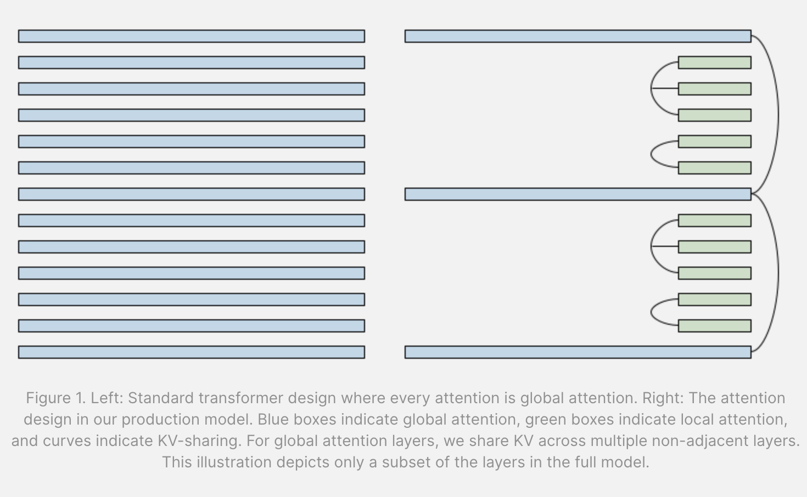
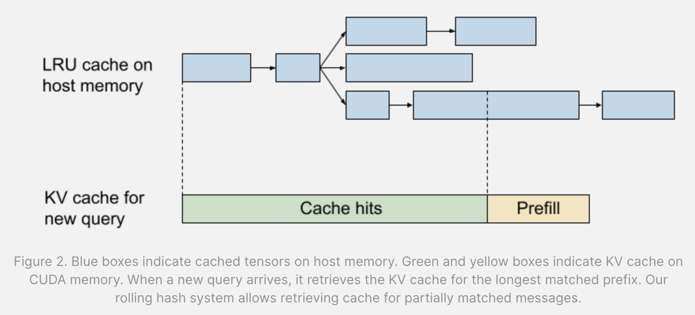

Optimizing AI Inference at Character.AI
### Optimizing AI Inference at Character.AI

## Summary
Character.AI has developed innovative techniques to optimize the inference process for large language models (LLMs), making it more efficient, cost-effective, and scalable. Key innovations include:

1. **Memory-efficient Architecture Design**:
   - Multi-Query Attention reduces KV cache size by 8x.
   - Hybrid Attention Horizons interleave local and global attention layers, significantly reducing complexity.
   - Cross Layer KV-sharing ties KV caches across neighboring layers, further reducing size.

1. **Stateful Caching**:
   - Efficient system for caching attention KV on host memory between chat turns.
   - Uses a rolling hash system to retrieve cache for partially matched messages, achieving a 95% cache rate.

2. **Quantization**:
   - Int8 quantization of model weights, activations, and KV cache for both training and serving.

These innovations have reduced inference costs by a factor of 33 since late 2022, enabling Character.AI to serve over 20,000 inference queries per second efficiently.

## Repository and Further Reading
For more details, visit the [Character.AI Research Blog](https://research.character.ai/optimizing-inference/).