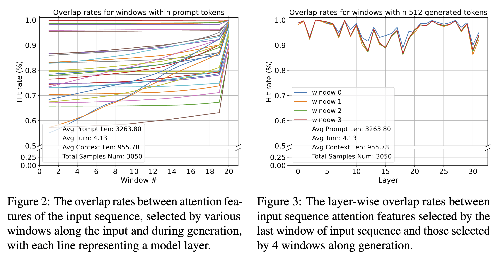

### SnapKV: LLM Knows What You are Looking for Before Generation

## Authors and Affiliations
- **Yuhong Li** (University of Illinois Urbana-Champaign)
- **Yingbing Huang** (University of Illinois Urbana-Champaign)
- **Bowen Yang** (Cohere)
- **Bharat Venkitesh** (Cohere)
- **Acyr Locatelli** (Cohere)
- **Hanchen Ye** (University of Illinois Urbana-Champaign)
- **Tianle Cai** (Princeton University)
- **Patrick Lewis** (Cohere)
- **Deming Chen** (University of Illinois Urbana-Champaign)

## Abstract
SnapKV is a fine-tuning-free approach that minimizes KV cache size while maintaining performance in LLMs. By automatically compressing KV caches, SnapKV reduces computational overhead and memory usage. It achieves a 3.6× speedup in generation speed and 8.2× memory efficiency while maintaining comparable performance across various long sequence datasets. SnapKV can process up to 380K context tokens on a single A100-80GB GPU, demonstrating minimal accuracy loss.

## Introduction
- **Context and Motivation**: LLMs face challenges with long context prompts due to inefficient KV cache during inference.
- **KV Cache Growth**: Increases in input length lead to higher memory demands and decoding latency.
- **SnapKV Innovation**: Leverages consistent attention patterns to compress KV cache without compromising performance.

## Methodology
### Observations and Attention Allocation

- **Attention Consistency**: Only a portion of prompt tokens are essential for response generation, remaining unchanged during generation.
- **Observational Experiments**: Patterns identified before generation help in compressing KV caches effectively.

### SnapKV Algorithm
1. **Voting for Important Features**:
   - Calculate attention weights of queries in the observation window.
   - Aggregate weights to identify significant prefix positions.
2. **Compressed KV Cache**:
   - Concatenate selected features with observation window features.
   - Store the compressed KV cache for generation, reducing memory usage.

### Algorithm Pseudo Code
```python
def snap_kv(query_states, key_states, value_states, window_size, max_capacity_prompt, kernel_size):
    bsz, num_heads, q_len, head_dim = query_states.shape
    assert key_states.shape[-2] == query_states.shape[-2]
    if q_len < max_capacity_prompt:
        return key_states, value_states
    attn_weights = compute_attn(query_states[..., -window_size:, :], key_states, attention_mask)
    vote = attn_weights[..., -window_size:, :-window_size].sum(dim=-2)
    pool_vote = pool1d(vote, kernel_size=kernel_size, padding=kernel_size//2, stride=1)
    indices = pool_vote.topk(max_capacity_prompt - window_size, dim=-1).indices
    indices = indices.unsqueeze(-1).expand(-1, -1, -1, head_dim)
    k_past_compress = key_states[..., :-window_size, :].gather(dim=2, index=indices)
    v_past_compress = value_states[..., :-window_size, :].gather(dim=2, index=indices)
    k_obs = key_states[..., -window_size:, :]
    v_obs = value_states[..., -window_size:, :]
    key_states = torch.cat([k_past_compress, k_obs], dim=2)
    value_states = torch.cat([v_past_compress, v_obs], dim=2)
    return key_states, value_states
```

## Experiments
### Performance Evaluation
- **Datasets**: LongBench with 17 datasets for QA, summarization, few-shot learning, and code generation.
- **Models**: LWM-Text-Chat-1M, LongChat-7b-v1.5-32k, Mistral-7B-Instruct-v0.2, Mixtral-8x7B-Instruct-v0.1.
- **Results**: SnapKV matches or exceeds baseline performance with significant memory savings.

### Robustness and Hit Rate
- **Observational Consistency**: High overlap rates in attention features during generation.
- **Instruction Positioning**: Consistent hit rates regardless of question position in prompts.

### Efficient Clustering via Pooling
- **Clustering Algorithm**: Utilizes pooling to retain comprehensive information, improving retrieval accuracy.

## Conclusion
SnapKV offers a practical solution for compressing KV cache in LLMs, enhancing memory efficiency and speed without compromising accuracy. Its design ensures effective handling of long-context prompts, making it valuable for real-world applications.

## Repository
For more information and access to the code, visit the [GitHub repository](https://github.com/FasterDecoding/SnapKV).