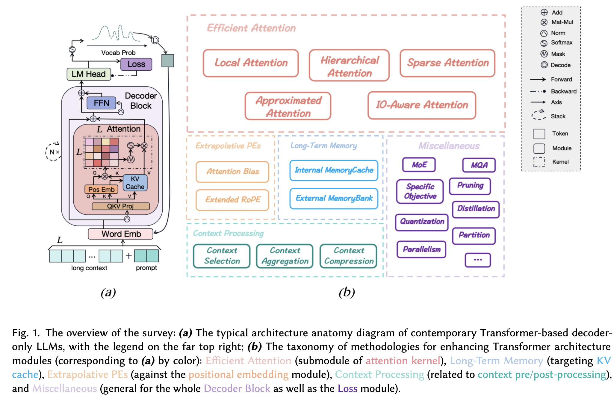

# Advancing Transformer Architecture in Long-Context Large Language Models: A Comprehensive Survey

## Authors and Affiliations
- **Yunpeng Huang** (State Key Lab of Novel Software Technology, Nanjing University, China)
- **Jingwei Xu** (State Key Lab of Novel Software Technology, Nanjing University, China)
- **Junyu Lai** (State Key Lab of Novel Software Technology, Nanjing University, China)
- **Zixu Jiang** (State Key Lab of Novel Software Technology, Nanjing University, China)
- **Taolue Chen** (School of Computing and Mathematical Sciences, Birkbeck, University of London, UK)
- **Zenan Li** (State Key Lab of Novel Software Technology, Nanjing University, China)
- **Yuan Yao** (State Key Lab of Novel Software Technology, Nanjing University, China)
- **Xiaoxing Ma** (State Key Lab of Novel Software Technology, Nanjing University, China)
- **Lijuan Yang** (Baidu Inc., China)
- **Hao Chen** (Baidu Inc., China)
- **Shupeng Li** (Baidu Inc., China)
- **Penghao Zhao** (Baidu Inc., China)

## Introduction
Transformer-based Large Language Models (LLMs) have significantly advanced Natural Language Processing (NLP), achieving milestones in various applications and pushing towards Artificial General Intelligence (AGI). However, their training on short text snippets limits their effectiveness with long-context prompts. This survey comprehensively reviews advancements in Transformer-based LLM architectures to improve long-context capabilities across the model lifecycle, including pre-training, fine-tuning, and inference stages.

## Problems with Current Transformers
1. **Attention Complexity**: Quadratic time and space complexities hinder processing long sequences.
2. **In-Context Memory**: Transformers lack a robust mechanism for long-term memory, relying solely on key-value (KV) caches.
3. **Max-Length Constraint**: Predefined sequence length limits degrade performance with longer sequences.

## Taxonomy of Methods
The survey categorizes advancements into five main classes:
1. **Efficient Attention**
2. **Long-Term Memory**
3. **Extrapolative Positional Encodings (PEs)**
4. **Context Processing**
5. **Miscellaneous Methods**

## Efficient Attention
### Local Attention
- **Block-wise Attention**: Segments input into blocks, reducing computation by focusing on local contexts.
- **Sliding Window Attention**: Uses a sliding window to limit attention to neighboring tokens, enhancing computational efficiency.
- **Global-Local Hybrid Attention**: Combines global tokens with local attention for a hierarchical approach.

### Hierarchical Attention
- **Two-Level Hierarchy**: Applies self-attention at both word and sentence levels to enhance document-level feature extraction.
- **Multi-Level Hierarchy**: Introduces a fine-to-coarse attention mechanism for multi-scale spans.

### Sparse Attention
- **Fixed Sparsity Patterns**: Employs predefined sparsity patterns, such as row-column factorized attention.
- **Adaptive Sparsity Patterns**: Learns sparsity adaptively based on embedding values.
- **Graph Sparsification**: Frames attention as a graph sparsification problem.

### Approximated Attention
- **Low-Rank Approximation**: Uses Singular Value Decomposition (SVD) to approximate attention matrices.
- **Nested Attention**: Decouples attention kernel into pack and unpack steps for linear complexity.
- **Kernelized Approximation**: Generalizes attention as a kernel machine for low-rank and sparse approximations.

### IO-Aware Attention
- **Memory-Efficient Attention**: Utilizes lazy softmax to compute attention with constant memory.
- **Flash Attention**: Reduces time and memory by optimizing GPU memory usage during attention computations.
- **Paged Attention**: Manages KV cache memory efficiently to minimize waste and allow flexible sharing across batched requests.

## Long-Term Memory
### Internal Memory Cache
- **Segment-Level Recurrence**: Caches outputs of previous segments to extend context.
- **Retrospective Recurrence**: Uses higher-level representations of previous segments for enhanced context.
- **Continuous-Signal Memory**: Represents memory as a continuous signal for unbounded context representation.

### External Memory Bank
- **Cosine-Based Retrieval Criteria**: Uses cosine similarity to retrieve relevant contexts from an external memory bank.
- **Heuristic Retrieval Criteria**: Utilizes heuristic methods like kNN search for memory retrieval.
- **Learnable Retrieval Criteria**: Employs learnable mechanisms to optimize memory retrieval dynamically.

## Evaluation
The survey explores evaluation necessities, including datasets, metrics, and baselines tailored for long-context LLMs, along with optimization toolkits to boost efficiency during training and inference.

## Challenges and Future Directions
The survey identifies key challenges in revamping Transformer structures for handling extensive contexts and suggests future research directions to overcome these challenges.

## Conclusion
The survey provides a comprehensive panorama of literature on architectural advancements for scaling effective context window lengths in Transformer-based LLMs. It highlights various methods, their benefits, and challenges, offering insights for future research in this rapidly evolving field.

## Repository
A curated repository of relevant literature is available and continuously updated at [GitHub - long-llms-learning](https://github.com/Strivin0311/long-llms-learning).